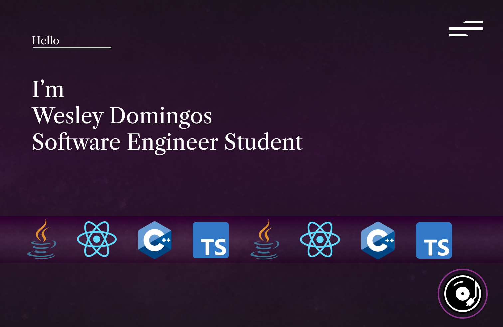
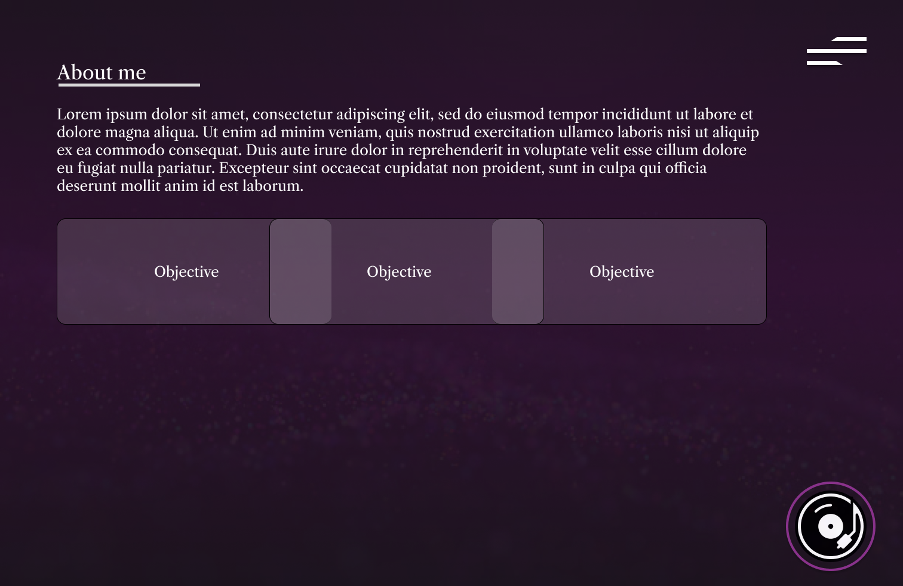
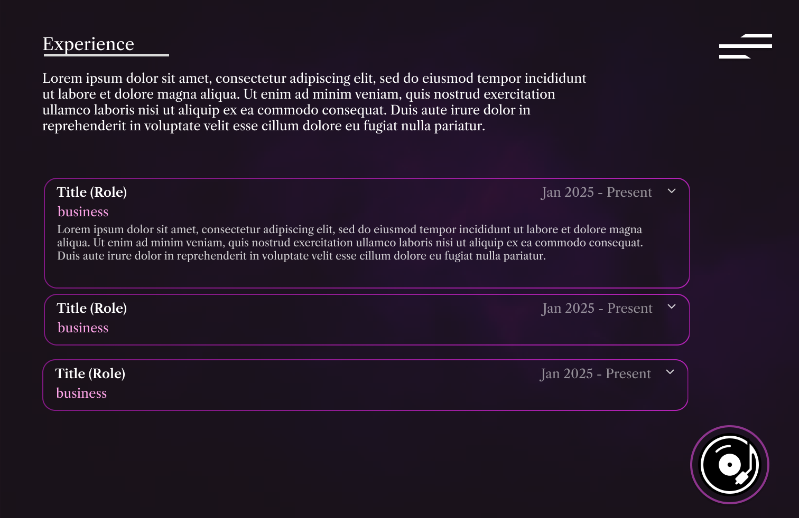
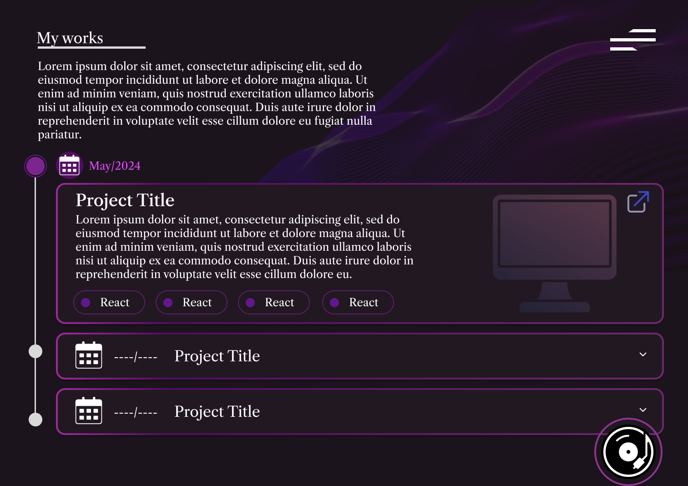
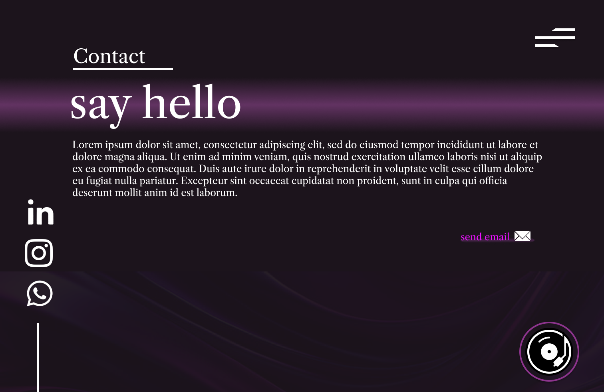
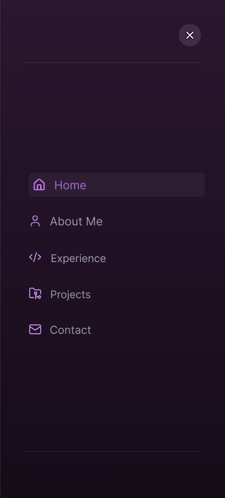
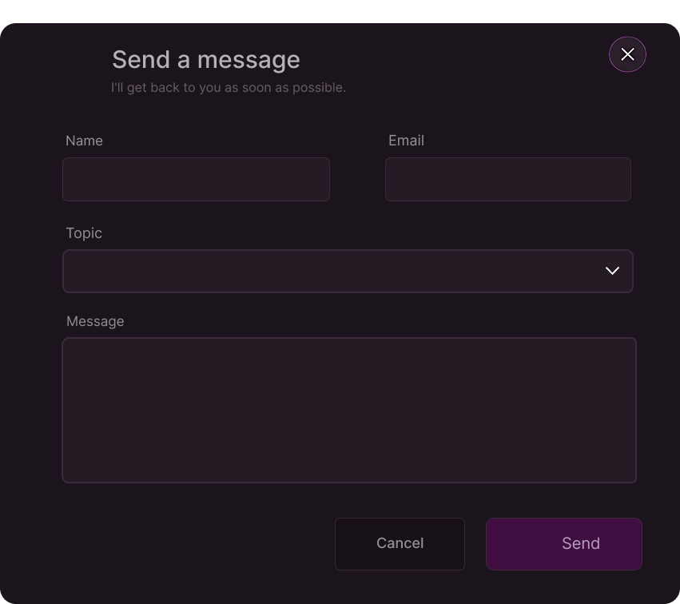

# Portfólio - Wesley Sousa Domingos

## Descrição do Projeto

Este é o projeto de desenvolvimento do meu portfólio profissional, com o objetivo de apresentar meus projetos, experiências profissionais, sobre mim e informações de contato.

## Tecnologias Previstas

O projeto está sendo desenvolvido no frontend utilizando-se:

- **[React](https://react.dev/)** Biblioteca principal para construção da interface.
- **[TypeScript](https://www.typescriptlang.org/)** - Tipagem estática.
- **[TailwindCSS](https://tailwindcss.com/)**  - Framework de CSS utilitário para estilização.
- **[Vite](https://vitejs.dev/)** - Ferramenta de build super rápida.

## Estrutura Inicial do Site

A estrutura base do código (`Codigo/frontend/src`) está organizada da seguinte maneira:

```
src/
├── assets/           # Imagens, ícones e outros arquivos estáticos
├── components/       # Componentes globais
├── contexts/         # Contextos
├── libs/             # Funções utilitárias
├── pages/            # Páginas principais
│   ├── Home.tsx
│   ├── About.tsx
│   ├── Experience.tsx
│   ├── Projects.tsx
│   └── Contact.tsx
├── translations/     # Arquivos de internacionalização (textos e traduções)
├── App.tsx           # Configuração de rotas
└── main.tsx          # Ponto de entrada
```

## 🎨 Protótipos das Telas (Design)

Abaixo estão os wireframes que representam o design das telas do portfólio:

### Página Inicial (Home)



### Sobre Mim



### Experiência



### Projetos



### Contato



### Menu de Navegação (Overlay)



### Modal de Envio de Mensagem


